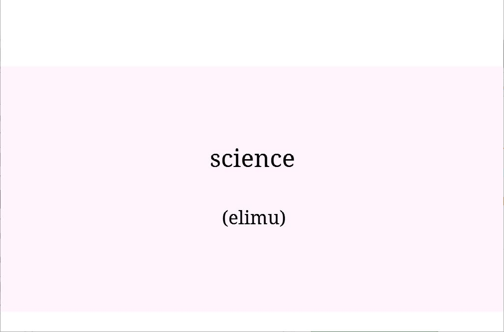
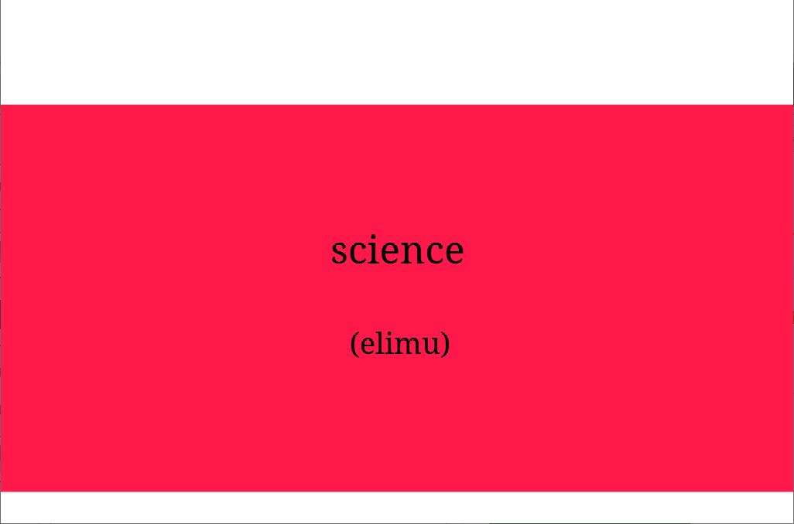

# Fact Learning with Adaptive Color Palette: Effect of Stimuli-Independent Hints (WIP)

## Introduction & motivation

This user model application focuses on enhancing learning a foreign vocabulary. It has been shown that changing the repetition times of a certain word depending on its difficulty to the user, decreases the time it takes for the user to learn the foreign vocabulary (TODO: cite -V.). On the other hand, many studies have been performed on the influence of colour on our everyday life. One major finding is the effect of colour on learning and making fast associations (many signs include colour, warning signs are usually red, etc.). 

Based on these findings, this user model study aims to determine whether employing colour allows the user to learn a foreign vocabulary faster. More specifically, derived from the aforementioned methods to change the repetition time of words depending on the difficulty of the word to the user, this user model will change its background colour based on the difficulty to the user.

In detail, this means that prior to the study process a colour palette will be selected for every participant. This colour palette associates a different colour to different degrees of difficulty _(refer to the next sections for the method to select this colour palette)_. Each time a word is displayed, the background wil changes to the colour from the colour palette that represents the difficulty the user model estimates the user is currently having with the word in question.

### Related Work

Van den Broek (2019) show that providing hints suprisingly does not have a long-lasting effect on later recall in fact-learning when the hints were not present.
A key difference is, however, that the hints used in their study were relevant to prompt (e.g. translating _vestis - clothes_: _Think of the word "vest"_).
Additionally, the hints were shown after the user response for a second chance.
In the case of our experiment, these "prompt context independent" hints are shown before the prompt is answered.
In an extreme case, this may lead to even worse later recall results because the user could associate the answer with the specific color (see [evaluation](#evaluation)) and not with the actual prompt.

## User-model & interface

Our model is based on the [spacing model used by SlimStampen](https://github.com/VanRijnLab/user-models-2122). To include the colour palette system in the model, we modify the background colour as the user is learning. The colours for each fact change according to how easy for the user to remember the fact. In the spacing model, the _rate of forgetting_ shows an estimated rate for a fact at a specified time, which could measure how difficult to remember the fact for the user. The colour palette from the easiest to the hardest scale should change in the proportion of the forgetting rate.

Examples of the interface will be like below. All the figures are drawn with OpenSesame (Mathôt et al., 2012) sketchpad item.

esay | medium | hard   
:---:|:---:|:---:
 |  | 

## Experiments setup

There are two factors: palette presence (3) and palette adaptivity (3) which is almost a 3x3 design though no adaptivity is needed for _no colour palette_.
Overall this results in 7 conditions.

TODO: write about pre-experiment

### Palette Presence

The experiment will be based on learning words from English to a foreign language, most probably Swahili.
We need 3 contrastive groups:
- P0: no colour palette
- P1: colour palette chosen by the user
<!-- - P2: colour palette chosen randomly -->
- P2: word colors chosen randomly (previously A1)

### Adaptivity

The palette in P1 and P2 is adapted proportionally to ACT-R difficulty results.

<!-- TODO: comment why we did not use static and explicitly dynamic -->

Vilém thinks the last level is needed to contrast the following phenomenon: 
If a word is for a longer time in e.g. bright red colour, I can associate this with the answer (similar to my *star* example).
In order to rule out that this phenomenon is positively influencing the results (and not the palette), we would need the fourth group of people.

### Scale

The exact scale is yet to be determined (number words, sessions and people).
Since we have 7 conditions, we may need e.g. 14 people to get 2 people per condition, and possibly more. 
Depending on whether we accept adaptivity as another factor, that increases the number of conditions.
Naturally, we will be using between-subject design because we can not change the configuration for someone mid-experiment.

### Evaluation

In order to determine the exact effect of the adaptive palette, the evaluation for users is yet another factor.
- E0: evaluation without any color cues
- E1: evaluation with the same scheme as the original configuration (e.g. P1A2)

<!-- TODO: this part could be within subject -->

## Data analysis & hypothesis

Observations regarding the performance (number of words correctly translated or number of words learned) of the participants is noted.
These observations are statistically examined with respect to the experiment conditions.

### Expectations

With the assumption that our hypothesis holds, we expect to see a higher performance among participants in the adaptive colour pallete condition with their own selection.
The random colour pallete should show a significantly lower performance among subjects, similar to no palette (though higher in E1 because of additional hints).
This would indicate that the perception (user defined) of a colour with a certain level of hardness allows the participant to scale their focus to match these and hence learn faster.
A similar performance in this group to the non-adaptive colour pallete group indicates that the colours do not serve merely as context cues with one to one relationship among colours and words. 
A colour that we associate with hardness will tend to cue us on paying extra attention to the learning process.
These cues will further help the learner pace their focus in relation to the context.
We believe that E1 will have better performance than E0 because of the similar reasons to those proposed by Van den broek (2019).

### Research questions

- Does the perception of colours with a level of hardness serve as cues for distributing focus across tasks in learning better?
- - We compare groups in the first factor (P0, P1, P2)
- Is there a prominent global colour pallete associated with the different levels of difficulty?
- - Which of the palettes is preffered (we expect imbalanced distribution)
- - Across the first two factors (P-A), does any lead to the best results as evaluated by either E0 or E1

## References

- Van den Broek, G. S., Segers, E., Van Rijn, H., Takashima, A., & Verhoeven, L. (2019). Effects of elaborate feedback during practice tests: Costs and benefits of retrieval prompts. Journal of Experimental Psychology: Applied, 25(4), 588.  
- Mathôt, S., Schreij, D., & Theeuwes, J. (2012). OpenSesame: An open-source, graphical experiment builder for the social sciences. Behavior Research Methods, 44(2), 314-324.
